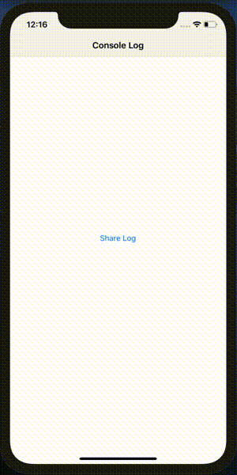

# ConsoleLogFile

<!-- [](https://cocoapods.org/pods/ConsoleLog)
[](https://cocoapods.org/pods/ConsoleLog)
[](https://cocoapods.org/pods/ConsoleLog)
[](https://developer.apple.com/swift/) -->

## Introduce

You can easily create a log file from the print statement in the project without changing print or anything else.



## Installation
Simply add the following line to your Podfile:

```ruby
pod 'ConsoleLogFile'
```

## Usage

```swift
import ConsoleLogFile
```

```swift
ConsoleLogFile.shared.createLog()
```

## Share

```swift
ConsoleLogFile.shared.shareFile(viewController: self)
```

## Customize

* ***fileName***: change log file name (default value is 'Console')
* ***maxFileSizeInMB***: if file size reach to max then it will be deleted (default value 5 MB)
* ***shouldOverrideOldFile***: if true then every time ConsoleLogFile.shared.createLog() execute it will override

```swift
ConsoleLogFile.shared.createLog(fileName: "Debug", maxFileSizeInMB: 10, shouldOverrideOldFile: true)
```

## TODO
* Use REST API to enable/disable log file creation

## Author

Jignesh, jigs.patelit@gmail.com

## License

ConsoleLogFile is available under the MIT license. See the LICENSE file for more info.
